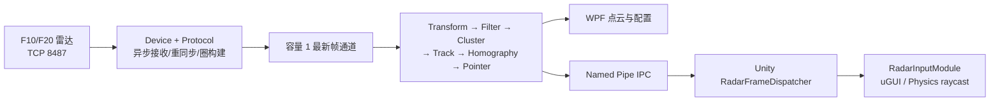

# 架构与线程模型

## 边界

`RadarBridge.exe` 是雷达、配置与处理算法的唯一所有者。Unity 不连接 `192.168.0.100:8487`，也不解析厂家 4 字节数据；它只通过 `Yuexin.RadarBridge` Named Pipe 获取 PointerFrame 与 Status。

## 项目职责

| 项目 | 职责 |
| --- | --- |
| `Radar.Contracts` | 跨模块不可变数据与 IPC DTO |
| `Radar.Device` | TCP 生命周期、重连、指标、`.radarrec` |
| `Radar.Configuration` | F10/F20 配置、校验与持久化 |
| `Radar.Protocol` | CRC、逐字节重同步、点解析与扫描圈 |
| `Radar.Processing` | 坐标变换、区域、聚类、跟踪、标定和 Pointer |
| `Radar.Ipc` | 长度前缀 JSON、握手、心跳和 Named Pipe 服务 |
| `Radar.Bridge.Wpf` | 组合根、运行时、点云绘制和现场控制界面 |

## 并发与背压

- TCP 接收全程异步；断线重连前清空字节解析器与未完成扫描圈，避免跨连接拼包。
- 采集到处理之间使用容量 1 的最新值通道。消费者落后时替换旧帧，不累积过时输入。
- WPF 只接收不可变快照；点云由一个自绘控件渲染，不为每个点创建控件。
- Pipe 客户端各自维护写入路径，Hello/HelloAck 完成后才接收业务帧；Ping/Pong 负责存活检测。
- 日志经容量 1024 的有界通道异步写到 `%LOCALAPPDATA%/RadarControl/logs/`，队列过载时保留较新记录。

## 生命周期

启动顺序：配置 → 日志/DI → Pipe 基础设施 → WPF。Unity Launcher 会先探测现有 Pipe，只在无法连接且启用 AutoStart 时启动 Bridge，并传入 `--parent-pid`。退出顺序为停止回放/模拟/采集 → 关闭 Pipe → 保存配置 → 刷新日志。
